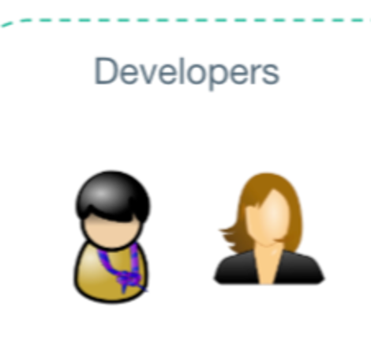
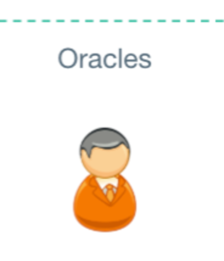
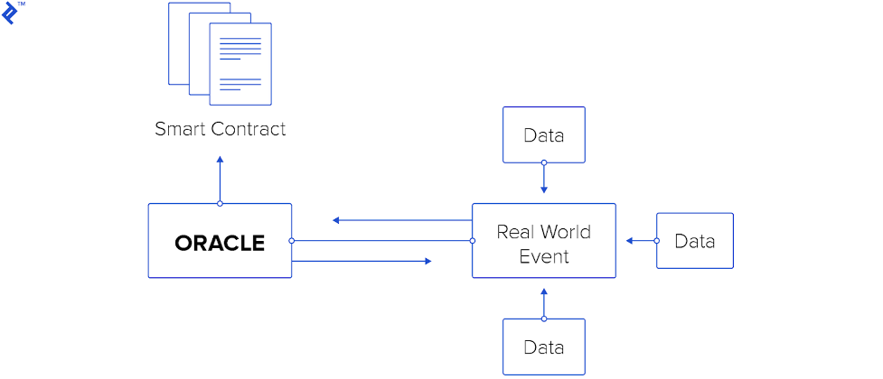
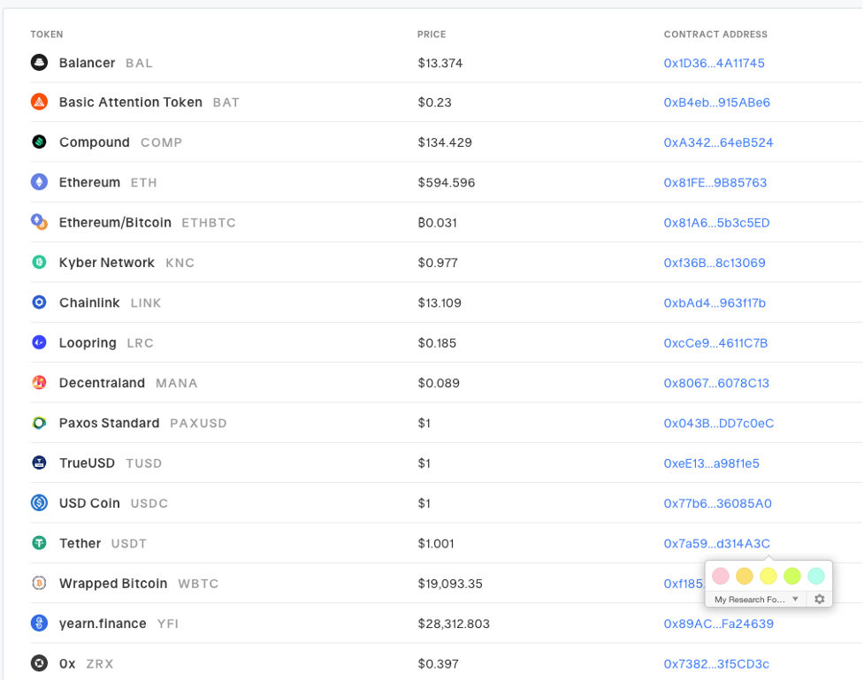
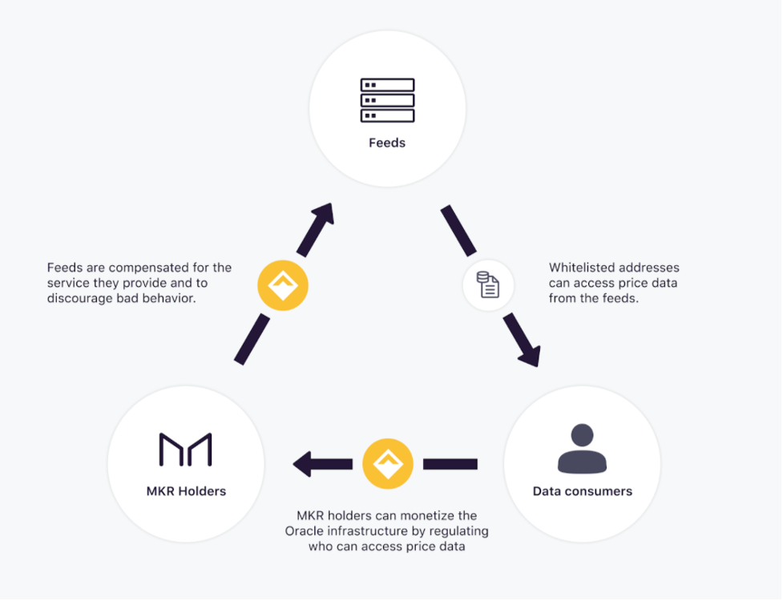
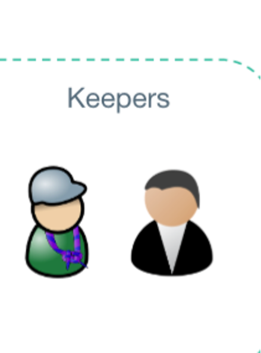
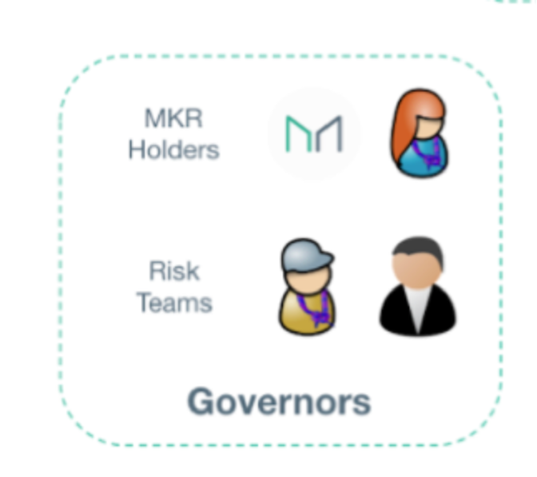
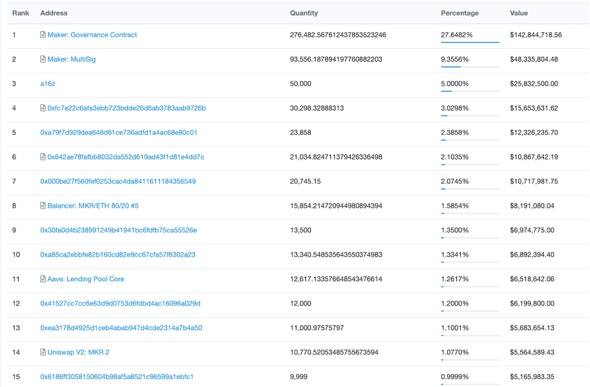

MakerDao has been become the third largest stable coin in the world.( https://coincodex.com/cryptocurrencies/sector/stablecoins/) Before we are diving into the concept of Dai of MakerDAO we have to talk about some financial concept and cryptocurrency such as Bitcoin and Ethereum, to let us have a better and easier understanding of the development and application of MakerDAO`s DAI. But we can summarize in one scentence that DAI of MakerDAO is the electronic US cash of the internet, since 1 DAI = 1 USD. MakerDAO is the protocol to ensure the security and privacy of the network. Then we are going to talk about the development of the ideas inspired MakerDAO protocol, they are Bitcoin and Ethereim. Finally we are going to talk about the MakerDAO.

Bitcoin created the blue ocean peer-to-peer online payment without trusting the third party regulations, it is designed as the electronic cash of the internet, but you can’t have the cash with too much high volatility, for example, using one bitcoin you may buy a pizza today, however it is worth a house tomorrow. The internet needs a better and more stable currency, which is called Stablecoins. Stablecoins are designed to mediate the volatility of crypto assets by looking up to an anchor which is a non-volatility currency such as the US dollar. The volatility of Bitcoin made it more like an investment than cash, so the Maker protocol created Dai, which is a collateral based cryptocurrency pegged  to the US dollar, as the internet of cash. The collateral based stablecoins give freedom and trust to the cryptocurrency world.

Bitcoin was invented by Satoshi Nakomoto in late 2008, the purpose of the Bitcoin is to create an electronic cash to allow end users or organizations to make trading directly without using or even trusting a third-party organization. (https://bitcoin.org/bitcoin.pdf) Or we can say that Bitcoin accomplished the concept of decentralization financial system that allow peer-to-peer value exchanges, when later Ethereum and MakerDAO are extending the decentralization concept to a better and broader development and application. Bitcoin successfully solved the double spending problem and built the decentralized trust across the internet.

Double spending problem existed for a long time, computer scientists and engineers had thought conquering it for decades. (Bitcoin’s Academic Pedigree) Double spending problem is that the cash can be spent twice. In the physical world, a dollar bill can not to be spent twice, since you only have one copy paper for each bill. But in the virtual network, there are risk to spend a digital currency twice. Bitcoin cleverly solved the problem by using proof of work consensus. The algorithm is defended by using the computational power to store the  transactions onto a internet chain that any one can publicly check and see. The chain of transaction records can not be tampered without competing with the rest of the Bitcoin and changed without redoing the proof-of-work.(Bitcoin: A Peer-to-Peer Electronic Cash System).

To do the analysis in MakerDAO, we have to have a good understanding of the MakerDao protocol.
A protocol is a set of standard rules that allow computers or devices to communicate regardless what operating systems or computers you are using. For example, you can send emails from an iPhone to Android device because they are using the same standard mail protocol.
In MakerDao protocol, which are built on smart contracts based on the Ethereum blockchain. It is a decentralized financial system that supports Multi-Collateral DAI, which is a stablecoin that targets pegging on US dollar.

MakerDAO system consists of several types of players, smart contracts, ERC-20 tokens. The types of players, maintainers, governors, and users, implement the security and advantages of the network, maintain the stability of DAI token, and facilitate and benefit from using the DAI token.

In this part of the article we focus on the users who are DAI holders and Vault owners.
The first question is what is DAI, Where are they from?
In short 1 DAI = 1 USD, and this is the mission that MakerDAO protocol is trying hard to maintain. DAI is a stablecoin cryptocurrency developed on Ethereum blockchain.

Users generate DAI by depositing collateral assets into Maker Vaults within the Maker Protocol.  For example, suppose you have $1000 worth ETH, then you are a Vault owner, you can access the Maker Vault to deposit your ETH to exchange DAI.
Oasis.app is a platform to deposit your collateral and generate DAI.

Then the question is why do you open a Vault?
So you don’t have to sell your asset but also liquidate it to serve any other purposes.

In this part of the article we focus on the types of players. The diagram above shows the Maker Protocol consists of three roles and the subset of individuals inside each title position. We will discuss them one by one first.

 

Developers are also part of the leaders or founders,and they also call them DAO teams. They are individuals and service providers, their mission is to provide development support while driving MakerDAO toward decentralization in a safe and secure way.

We checked they have 55 members and 8 openings. 
https://makerdao.com/en/careers/

 

In a simple way, oracles are information, a real-time dynamic information, such as the volatile price of ETH, the weather of now, or generate a random number for gambling. It’s like a third party API for data feed to update the information that smart contracts need.
 
 

Oracle has the responsibility to feed real world real time data to a smart contract. 

In MakerDAO, there are two major types of Oracles: Price Oracles and Emergency Oracles. Inside each type, there are smaller components for different data feed, technical responsibility etc. We will talk about the technical details later.
Let’s talk about the second Emergency Oracles first.
Emergency Oracles are the last line of security in the protocol. MKR voters have the right to trigger an Emergency shutdown to prevent asset loss.

So, first is the price Oracle.
In MakerDAO, collateral assets are the core deposits that you can use to exchange DAI, and 1 DAI = 1 USD.
Then the MakerDAO protocol has to know the price of your collateral in the real physical world beyond the EVM world.
The Price Oracles provides real-time information about the market price of the collateral assets.
Then we may have questions about the authenticity and accuracy of the Price Oracles. The Price Oracles provide data from the external world, and the smart contracts are executed depending on that important information. For example, if my ETH is worth $500, but the Oracle saids it worths $450, then we have a problem. But if is $550, then I’m fine, the MakerDAO then is unstable at risk.

So the accuracy of the Price Oracles are vital.
MakerDAO Protocol estimates the collateral prices from a decentralized Oracle infrastructure.
This decentralized Oracle infrastructure is a mechanism that consists of a broad set of data feeds that bring data from outside of the blockchain onto the blockchain.
There is one main task is to ensure the collateral price is sufficient to back up the DAI generated. 

Then we go deeper to those data feeds nodes, who or what are they?
Data Feeds are bots that are run by individuals or organizations.
https://blog.makerdao.com/introducing-oracles-v2-and-defi-feeds/

 

There are 14 feeds for the Oracle price used by Single-collateral DAI.

Then the next question is what is motivating the individual or organization nodes participating?
 
 

 
 
 Keepers keep the DAI soft pegged on USD, the target is 1 DAI = 1 USD. They buy DAI when 1DAI < 1USD, they sell DAI when 1DAI > 1 USD.

 

Next, we can talk about the other role player is Governors.
Before we talk about who are or what the responsibilities of Governor, we have to introduce the ERC-token in MakerDao Protocol: MKR.

Then first question is what is MKR, where are they come from. 
To answer this question, MKR is created with the launching of MakerDao protocol, there are 1,000,000 tokens at its inception. When you are hold MKRs your are part of the governors, then you can vote on a number of different things. That also means you have the responsibility to take care of the stability of the DAI soft pegged on the USD dollar.
 
https://etherscan.io/token/0x9f8f72aa9304c8b593d555f12ef6589cc3a579a2#balances

Here is the top 15 MKR holders who are individuals, organizations or smart contracts.

We also made the data gathering process to analyze the patterns of using MakerDao. We gathered data from Smart Contracts, Transaction Blocks, Running Contracts. There are Accounts: 146356, Actions: 918816, Ethereum Blocks: 316423.

The first pattern we found is the network usesage over time.
 

Those are the main functions called in the smartcontracts.

- Open: Create a new collateralized debt position
- Lock: Post additional SKR collateral to a cup
- Draw: Issue the specified amount of sai stablecoins
- Free: Remove excess SKR collateral from a cup
- Wipe: Repay some portion of your existing sai debt
- Bite: Initiate liquidation of an undercollateral cup
- Shut: Close a cup
- Give: Transfer ownership of a cup

Then we found the actions in graph.

And actions over time pattern.

Then we found the patterns in debt collaterals.

And the ratio relationship.

In conclusion, MakerDAO is not as simple as Bitcoin. The inner relationships existing inside MakerDAO is much more complicated and complex. That's why MakerDAO is can be more updated and full functional in mutiple domains, such as borrowing and lending processes. MakerDAO also makes sure to keep DAI soft pegged on US dollar, in order to secure the assest value to investors and users. MakerDAO protocol is driving the decentralized financial system into a new era.

